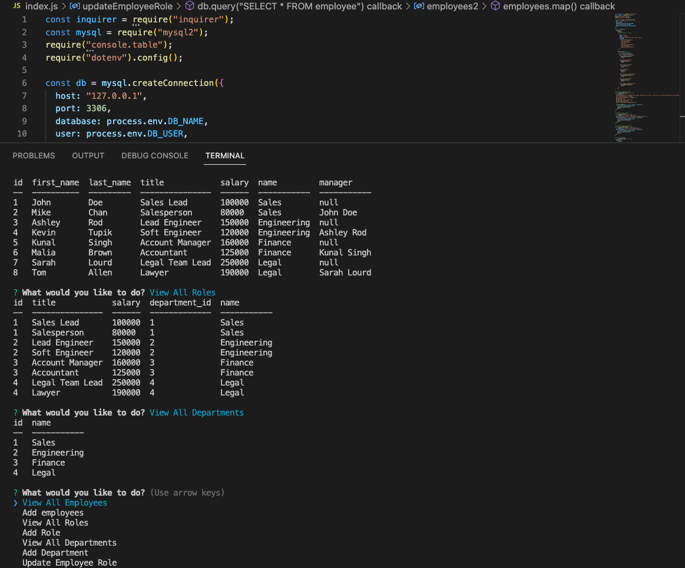

# Staff Pilot (Employee Tracker)

## Table of Contents

- [Description of the Project](#description)
- [Installation](#installation)
- [Screenshot](#screenshot)
- [Links](#links)
- [License](#license)

## Description

This is a command-line application to manage a company's employee database, using Node.js, Inquirer, and MySQL. You will be able to view and manage the departments, roles, and employees in your company, so that you can organize and plan your business

## Installation

- Uses the Inquirer package.
- Uses the MySQL2 package to connect to a MySQL database.
- Uses the console.table package to print MySQL rows to the console.

## Screenshot

## Links

- GitHub: https://github.com/Chenson92/Employee-Tracker
- Walk Through Video: https://drive.google.com/file/d/1YDxMv3LxMu0Y6sYk-sXLpkcWJJBQDHrq/view

## License

This project is licensed under the terms of the MIT license.
[License](https://opensource.org/licenses/MIT)
